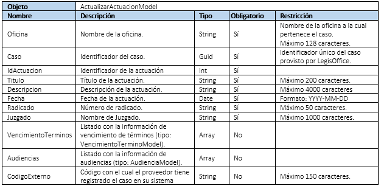
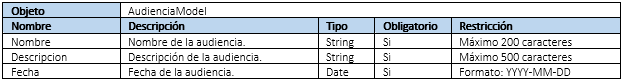
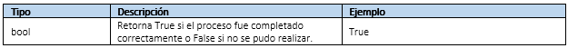

****************
Servicio Web Api
****************

El protocolo HTTP no sirve sólo para proveer páginas web sino también es una potente plataforma para la construcción de APIs que exponen 
servicios y datos. HTTP es simple, flexible y ubicuo. Casi cualquier plataforma actualmente tiene o utiliza el protocolo HTTP, por lo que 
los servicios HTTP pueden llegar a una amplia gama de clientes, incluyendo los navegadores, dispositivos móviles y aplicaciones de escritorio 
tradicionales. 

Microsoft ASP.NET WebAPI es un marco para la construcción de las API web en la parte superior del marco .NET de Microsoft 
que permite aprovechar todo el conjunto de características presente sobre el protocolo HTTP. 

El servicio WebAPI de LegisOffice utiliza esta herramienta de Microsoft WebAPI para exponer servicios a sus clientes mediante 
peticiones HTTP (GET, POST, PUT, DELETE) en formato JSON.

El servicio WebAPI de LegisOffice se encarga de exponer métodos generales de recepción de información de vigilancia judicial 
a partir de un mecanismo de autenticación basado en Usuario / Clave / Proveedor. 

Para poder acceder a algún un recurso -excepto Test y ValidarCredenciales- es requerido que el cliente incluya el Token 
de acceso - obtenido al validar sus credenciales - en el encabezado de autorización de la petición HTTP.

A continuación, se describen a detalla los contratos expuestos en el servicio WebAPI.

URL del servicio en producción: https://vj.legisoffice.com/LOServiceVJ/. Todos los recursos están agrupados sobre el controlador 
llamado: VJ, la URL de consumo quedaría así: https://vj.legisoffice.com/LOServiceVJ/VJ/ + EL RECURSO SOLICITADO

**Test**

Método HTTP: GET
Verifica si el servicio de vigilancia judicial está disponible.
INFORMACIÓN SOLICITUD
Parámetros URL: Ninguno

Parámetros cuerpo solicitud: Ninguno

INFORMACIÓN RESPUESTA

+--------------+-------------------------------------+----------------+
|  Tipo        | Descripcion                         | Mensaje        |
|              |                                     |                |
+==============+=====================================+================+
| String       | Mensaje de conexión establecida     | Conexión       |
+--------------+-------------------------------------+----------------+

===================
ValidarCredenciales
===================

Método HTTP: **POST**
Valida las credenciales de autenticación para un proveedor y genera un identificador único de sesión

---------------------
INFORMACIÓN SOLICITUD
---------------------

Parámetros URL: Ninguno

Parámetros cuerpo solicitud:

+--------------+-------------------------------------------------------------------------------------+
|  Objeto      | AutenticaciónModel                                                                  | 
+==============+=====================================+================+================+=============+
| Nombre       | Descripcion                         | Tipo           | Obligatorio    |Restricción  | 
+--------------+-------------------------------------+----------------+----------------+-------------+
| Usuario      | Nombre de Usuario                   | String         | Si             |             | 
+--------------+-------------------------------------+----------------+----------------+-------------+
| Clave        | Constraseña                         | String         | Si             |             | 
+--------------+-------------------------------------+----------------+----------------+-------------+
| Proveedor    | Nombre del proveedor                | String         | Si             |             | 
+--------------+-------------------------------------+----------------+----------------+-------------+

---------------------
INFORMACIÓN RESPUESTA
---------------------

+--------------+-------------------------------------+-----------------------------------------------+
|  Tipo        | Descripcion                         | Ejemplo                                       | 
+==============+=====================================+===============================================+
| Guid         | Token: Identificador único de acceso| Credenciales válidas:                         |
|              | requerido para consumir los métodos | EBA5899B-1CBA-4EAB-9C16-9C0CCD33A3FF          |
|              | del servicio WebAPI.                | Credenciales no válidas: mensaje de           |        
|              |                                     | respuesta: Acceso no autorizado con           |
|              |                                     | código HTTP 401.                              |
+--------------+-------------------------------------+-----------------------------------------------+

==================
RegistrarActuacion
==================

*Método HTTP:* **POST**
Registra la información de una actuación y retorna el identificador único de la actuación.

---------------------
INFORMACIÓN SOLICITUD
---------------------

Cabecera de autenticación: Authentication = Token -Espacio- Guid obtenido como respuesta al consumir el método ValidarCredenciales codificado en base64 (ISO-8859-1)

Parámetros URL: Ninguno

Parámetros cuerpo solicitud:

+--------------+--------------------------------------------------------------------------------------------------------------------------+
|  Objeto      | RegistrarActuacionModel                                                                                                  | 
+==============+=====================================+================+================+==================================================+
| Nombre       | Descripcion                         | Tipo           | Obligatorio    |Restricción                                       | 
+--------------+-------------------------------------+----------------+----------------+--------------------------------------------------+
| Oficina      | Nombre de la Oficina                | String         | Si             | Nombre de la oficina a la cual pertenece el caso.|
|              |                                     |                |                | Máximo 128 caracteres.                           |
+--------------+-------------------------------------+----------------+----------------+--------------------------------------------------+
| Caso         | Identificador del caso              | Guid           | Si             | Identificador único del caso provisto por        | 
|              |                                     |                |                | LegisOffice                                      | 
+--------------+-------------------------------------+----------------+----------------+--------------------------------------------------+
| Titulo       | Título de la actuación              | String         | Si             | Máximo 200 caracteres                            | 
+--------------+-------------------------------------+----------------+----------------+--------------------------------------------------+
| Descripción  | Descripción de la actuación         | String         | Si             | Máximo 4000 caracteres                           | 
+--------------+-------------------------------------+----------------+----------------+--------------------------------------------------+
| Fecha        | Fecha de la actuación               | Date           | Si             | Formato: YYYY-MM-DD                              | 
+--------------+-------------------------------------+----------------+----------------+--------------------------------------------------+
| Radicado     | Número de radicado                  | String         | Si             | Máximo 50 caracteres.                            | 
+--------------+-------------------------------------+----------------+----------------+--------------------------------------------------+
| Juzgado      | Nombre del juzgado                  | String         | Si             | Máximo 1000 Caracteres                           | 
+--------------+-------------------------------------+----------------+----------------+--------------------------------------------------+
| Vencimiendo  | Listado con la información de ven   | Array          |No              |                                                  |
| de términos  | cimiento de términos                |                |                |                                                  |
|              | (tipo: VencimientoTerminoModel).    |                |                |                                                  |
+--------------+-------------------------------------+----------------+----------------+--------------------------------------------------+
| Audiencias   | Listado con la información de       | Array          |No              |                                                  |
|              | audiencias (tipo: AudienciaModel).  |                |                |                                                  |
|              |                                     |                |                |                                                  |
+--------------+-------------------------------------+----------------+----------------+--------------------------------------------------+
| Finalización | Indica si con esta actuación se está| Bool           |No              |                                                  |
| Servicio     | finalizado el servicio de Vigilancia|                |                |                                                  |
|              | Judicial para este caso.            |                |                |                                                  |
+--------------+-------------------------------------+----------------+----------------+--------------------------------------------------+
| CódigoExterno| Código con el cual el proveedor     | String         |No              | Máximo 150 caracteres                            |
|              | tiene registrado el caso o actuación|                |                |                                                  |
|              | en su sistema                       |                |                |                                                  |
+--------------+-------------------------------------+----------------+----------------+--------------------------------------------------+

Propiedad VencimientoTerminos  de tipo VencimientoTerminoModel.

.. image:: imagenes/tabla_pvt.png

Propiedad Audiencias de tipo AudienciaModel.

.. image:: imagenes/tabla_am.png

---------------------
INFORMACIÓN RESPUESTA
---------------------

.. image:: imagenes/tabla3.png

===========================
RegistrarDocumentoActuacion
===========================

*Método HTTP:* **POST**
Registra un documento sobre una actuación y retorna si se pudo registrar o no.

---------------------
INFORMACIÓN SOLICITUD
---------------------
Cabecera de autenticación: Authentication = Token -Espacio- Guid obtenido como respuesta al consumir el método ValidarCredenciales codificado en base64 (ISO-8859-1)

Parámetros URL: Ninguno

Parámetros cuerpo solicitud:

.. image:: imagenes/tabla4.png

---------------------
INFORMACIÓN RESPUESTA
---------------------

.. image:: imagenes/tabla5.png

===================
ActualizarActuacion
===================
*Método HTTP:* **PUT**
Actualiza la información de una actuación y retorna si se pudo actualizar o no.

---------------------
INFORMACIÓN SOLICITUD
---------------------
Cabecera de autenticación: Authentication = Token -Espacio- Guid obtenido como respuesta al consumir el método ValidarCredenciales codificado en base64 (ISO-8859-1)

Parámetros URL: Ninguno

Parámetros cuerpo solicitud:

Propiedad VencimientoTerminos  de tipo VencimientoTerminoModel.

.. image:: imagenes/tabla7.png

Propiedad Audiencias de tipo AudienciaModel.

---------------------
INFORMACIÓN RESPUESTA
---------------------

=================
EliminarActuacion
=================

*Método HTTP:* **POST**
Elimina una actuación y los documentos asociados a la misma. Retorna si se pudo realizar la eliminación o no.

---------------------
INFORMACIÓN SOLICITUD
---------------------
Cabecera de autenticación: Authentication = Token -Espacio- Guid obtenido como respuesta al consumir el método ValidarCredenciales codificado en base64 (ISO-8859-1)

Parámetros URL: Ninguno

Parámetros cuerpo solicitud:

.. image:: imagenes/tabla10.png

---------------------
INFORMACIÓN RESPUESTA
---------------------
.. image:: imagenes/tabla11.png

